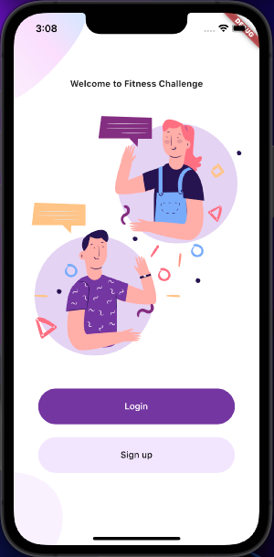
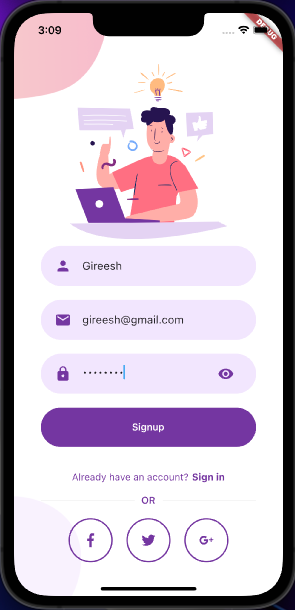

# Fitness Challenge

Pursuing your fitness goals is fun together with friends. Challenge your friends for daily activities and see who's leading. You can use any fitness trackers such as Apple Watch, Fitbit etc. Sync the tracker with Apple Health / Google Fit. The app reads daily activities from Apple Health / Google Fit.

## Features
* User signs up and/or signs in
* See all challenges they are participating in and their current rank
* Create new challenge and choose the measure type - #Steps or Calories Burned.
* Invite friends to the challenge using their email id
* Sync their health data from Apple Health/Google fit
* Open a challenge and see the leaderboard of all users


<!-- 'Made with Appwrite' badge -->
<a href="https://appwrite.io/">
  
</a>

Fitness Challenge is built on Flutter and [Appwrite](https://appwrite.io/). It uses AppWrite for:
* New user registration
* User login
* Storing all documents (new challenges, user activities etc.) in the database
* Calculate leaderboard using server side functions

## Screenshots
<p float="left">
    
    
    
<br>
<p float="left">


</p>

## Getting Started

* Install [Appwrite](https://appwrite.io/docs/installation), open AppWrite console (https://localhost) and create your project
* [Add Flutter platorm](https://appwrite.io/docs/getting-started-for-flutter) in your Appwrite project. Update the deployment target as shown in the [ios](https://appwrite.io/docs/getting-started-for-flutter#iOS) secion
* Enable Healthkit in Capabilities tab in Xcode as shown [here](https://developer.apple.com/documentation/healthkit/setting_up_healthkit)
* Append the following to info.plist
```
<key>NSHealthShareUsageDescription</key>
<string>We will sync your data with the Apple Health app to give you better insights</string>
<key>NSHealthUpdateUsageDescription</key>
<string>We will sync your data with the Apple Health app to give you better insights</string>
```
* Create the following collections in appwrite console
  * users: user_id (text), user_name (text), email (text), health_last_sync (numeric)
  * user_activities: user_id (text), measure_type (text), value (numeric)
  * challenges: challenge_id (text), challenge_name (text), measure_type (text)
  * leaderboard: challenge_id (text), challenge_name (text), user_id (text), user_name (text), email (text), rank (numeric), measure_type (text), value (numeric)
* Create user profile creation server side function in Appwrite console as described in [here](https://github.com/gireeshp/fitness_challenge/tree/master/functions/create_user_profile)
* Create leaderboard calculation function in Appwrite console as described in [here](https://github.com/gireeshp/fitness_challenge/tree/master/functions/calculate_leaderboard)


## UI Design
Welcome, login & sign up pages are taken from this [github repo](https://github.com/abuanwar072/Welcome-Login-Signup-Page-Flutter).


## What's next
* User authentication with Other OAuth providers (Google, Facebook, Twitter etc.) using Appwrite's built-in OAuth2 integration
* Email verification using Appwrite'e email verification feature
* Password recovery using Appwrite's password recovery feature
* Add a user to the challenge only after their confirmation (currently they are added by default when invited)
* Better UI :)
* Start date & end date for challenges and declaration of winners
* Option to choose other health data types in challenge - currently only Steps-count and Active-energy-burned are considered for challenge
* Integration with Google Fit (currently integrated with Apple Health only)
* Sync health data incrementally and automatically (without specific button click)